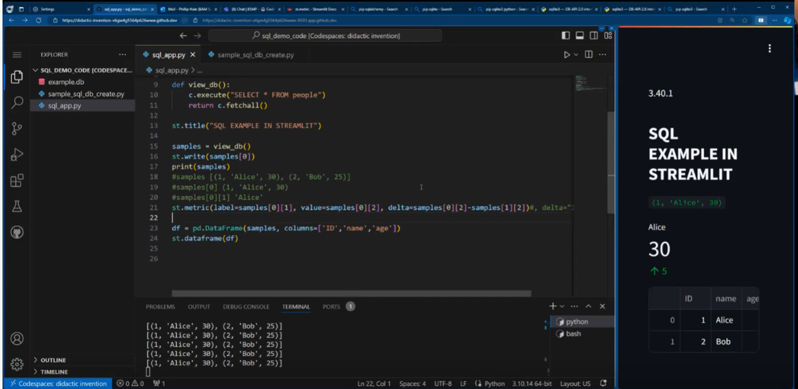

# SQL Integration with Streamlit: A Practical Guide 🚀  
   
Welcome to a comprehensive tutorial on integrating SQL databases with Streamlit to create interactive data visualization web applications. This project includes creating an SQLite database, connecting it to Python, and presenting data using Streamlit.   

> [Streamlit SQL Office Hours Recording](https://m365x06915360.sharepoint.com/:v:/s/advcoding/EZXK5kSA1BtHoFkKCZ_jYfcBVIB2c0sv--6KUFS2gJv6LA?e=CzQp8p)   
  
## Module Breakdown 📚  
   
Throughout this project, you'll gain insights into:  
   
1. **SQLite Database Setup**: Learn to create an SQLite database and establish a connection with Python.   
2. **Streamlit and SQL**: Understand how to leverage Streamlit to interact with the SQL database.  
3. **Data Visualization**: Discover how to utilize pandas for data manipulation and Streamlit for data visualization from the SQL database.  
   
## Key Features 🌟  
   
- **SQLite Database Setup**: Step-by-step guidance on setting up an SQLite database and connecting it to Python.  
- **Streamlit Integration**: Detailed instructions on how to use Streamlit for SQL database interactions, executing SQL commands, and displaying results.  
- **Data Visualization**: Learn to use pandas for data handling and Streamlit for visualizing SQL database data.  
- **Troubleshooting Guide**: Handy solutions to common problems related to database connections, SQL commands, and Streamlit functionalities.  
   
  
## Getting Started 🏁  
   
No need for manual package installations. Just execute this project in a Codespace or dev container, and all necessary packages will be installed automatically.  
   
## Usage 💻  
   
1. **Create the Database**: Execute `python sample_sql_db_create.py` to set up the SQLite database.  
2. **Launch the Streamlit App**: Run `streamlit run app.py` to initiate the Streamlit app and visualize SQL database data.  
   
## Useful Resources 📖  
   
- [sqlite3 - DB-API 2.0 interface for SQLite databases - Python 3.12.4 documentation](https://docs.python.org/3/library/sqlite3.html#sqlite3-tutorial)  
- [st.connections.SQLConnection - Streamlit Docs](https://docs.streamlit.io/develop/api-reference/connections/st.connections.sqlconnection)  
- [Streamlit SQL Office Hours Recording](https://m365x06915360.sharepoint.com/:v:/s/advcoding/EZXK5kSA1BtHoFkKCZ_jYfcBVIB2c0sv--6KUFS2gJv6LA?e=CzQp8p)   
  
Happy Coding! 🎉